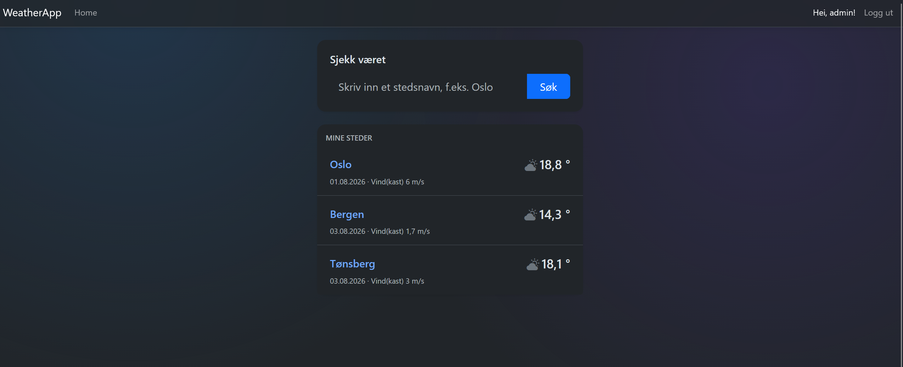

# WeatherApp

A web app for searching weather forecasts and managing saved weather stations, built with ASP.NET Core MVC.

## What it does

This app lets you search for a place name and get a live weather forecast:

* Weather observations (temperature, wind) linked to each station
* Searches automatically save the station and its forecast to the database

## Login and access control

The app uses ASP.NET Core Identity for authentication. Registration and login are handled through Identity's built-in pages.

Searching for weather, browsing stations, viewing details, and deleting entries is open to everyone, including users who aren't logged in. Only logged-in users can add ("Legg til nytt sted") or edit ("Rediger") stations and observations.

### Test account
Email: admin@test.com
Password: Test 123456.

To log in:

1. Go to `/Identity/Account/Login` and log in with the account above, or register your own at `/Identity/Account/Register`

Once logged in, "Legg til nytt sted" and "Rediger" links become available.

## Built with

* ASP.NET Core MVC
* EF Core + SQLite (Code First, migrations)
* ASP.NET Core Identity for login
* Kartverket API for place name lookup
* Yr/MET API for weather forecasts
* xUnit for testing

## Running it locally
dotnet restore
dotnet ef database update
dotnet run

## Project structure

* `Models/` - WeatherStation, WeatherObservation, Coordinates
* `Data/` - the EF Core database context (inherits from IdentityDbContext)
* `Services/` - LocationService and WeatherForecastService (external API calls)
* `Controllers/` + `Views/` - WeatherStations, WeatherObservations, WeatherSearch, Home
* `Areas/Identity/` - login, registration, and account management pages (Identity)
* `WeatherApp.Tests/` - xUnit tests for WeatherStationsController

## Screenshot

